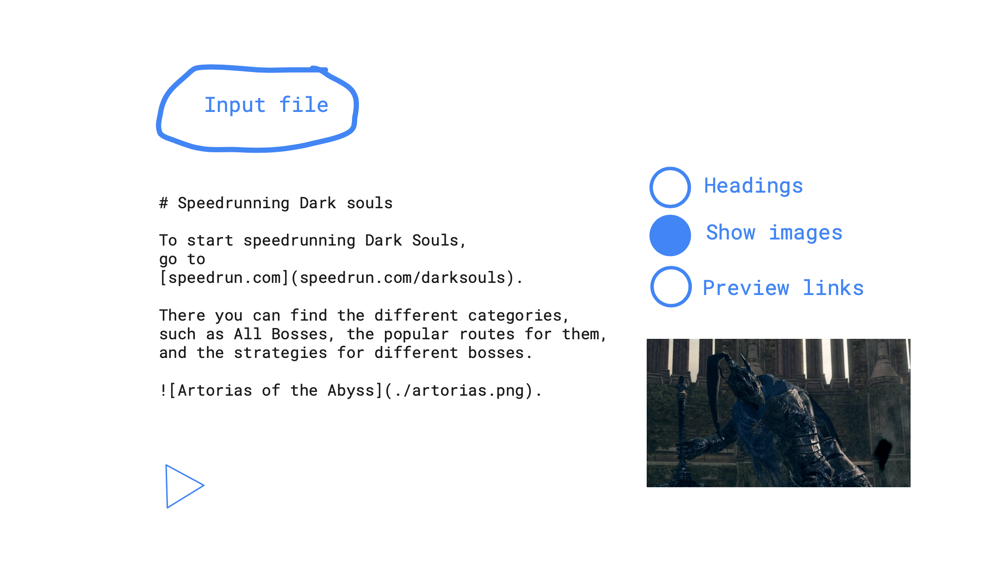

# Understanding stuff

Given a text document, make it possible to:

- Read it out loud
- Show any images linked
- Open links and read them

Maybe start with just markdown as input.
Can use the SpeechSynthesis API built into the browser.
If I should use the browser as the frontend.
I listened to a scientific pdf and it was much easier and more fun compared to reading it.
The way people present their content might not work for me.
Make it possible for me to experience it in other ways.
Sound is good, as well as images and video.
Having the headline shown as text could help summarize what is going on.

This is pretty good:

```sh
say -f README.md -v Samantha --interactive=/green
```

## What it could look like

.
